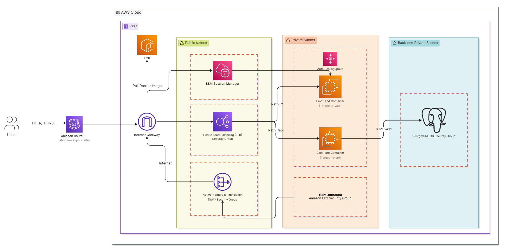
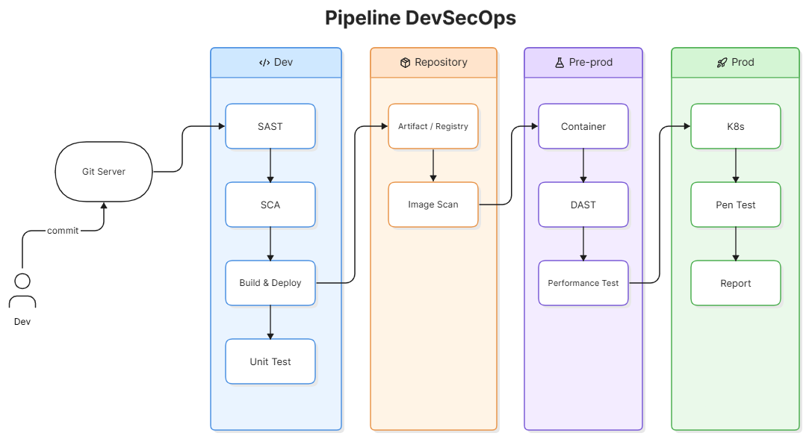
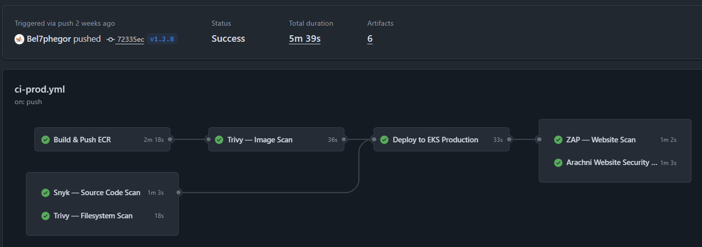
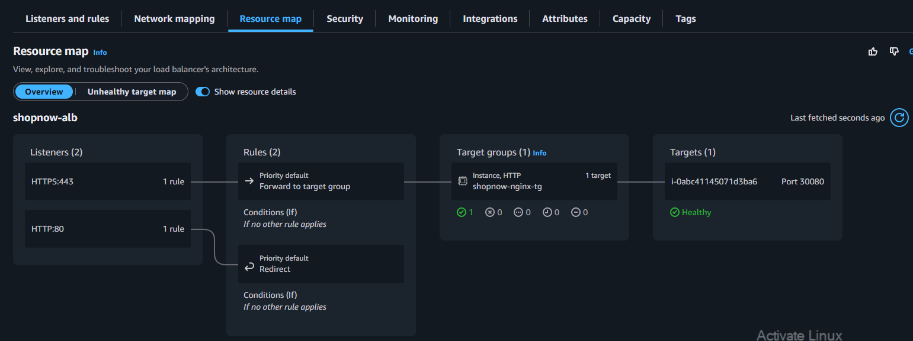
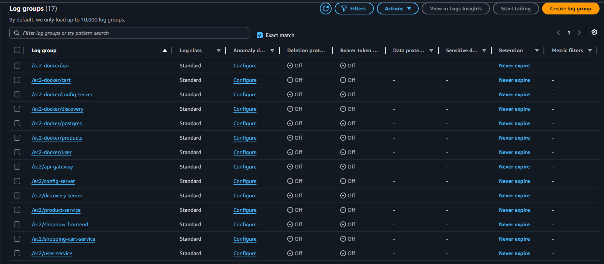
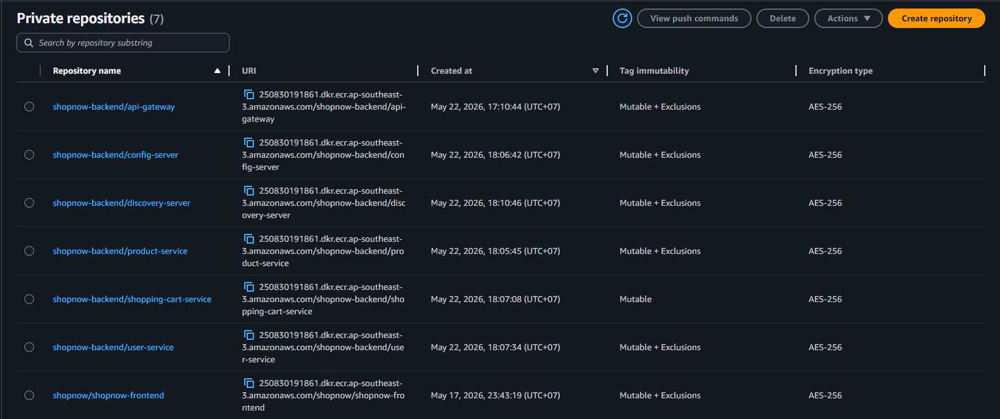
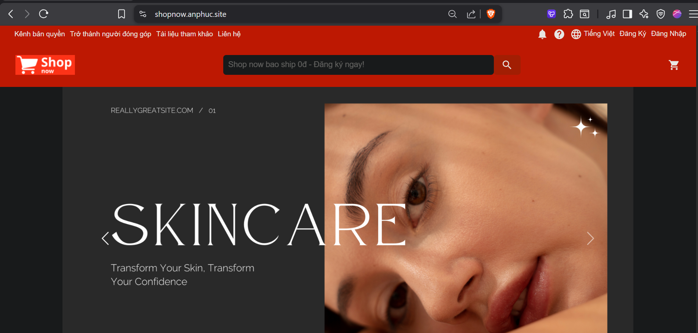
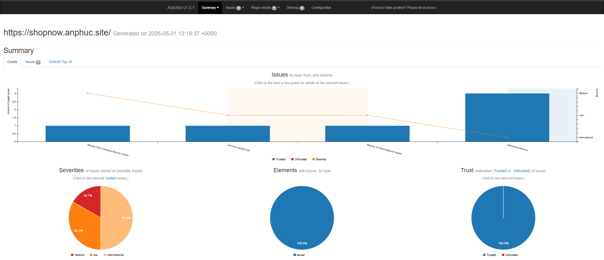
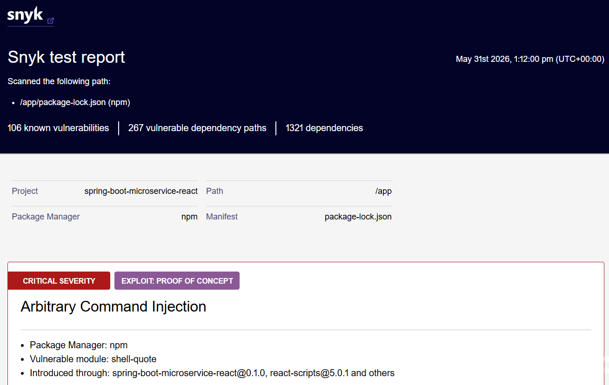
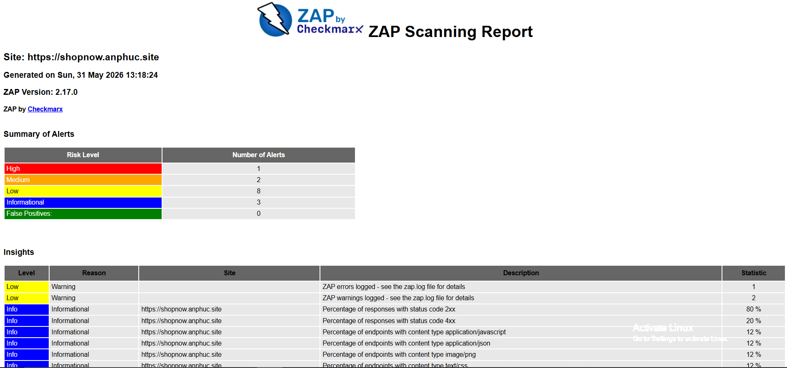

# ShopNow Frontend: React E-Commerce with AWS Infrastructure & DevSecOps Pipeline

React-based e-commerce frontend deployed on AWS with a complete DevSecOps CI/CD pipeline, Helm, Docker containerization, and multi-environment deployment (Development & Production).

<details>
<summary><strong>Table of Contents</strong></summary>

- [ShopNow Frontend: React E-Commerce with AWS Infrastructure \& DevSecOps Pipeline](#shopnow-frontend-react-e-commerce-with-aws-infrastructure--devsecops-pipeline)
  - [1. System Architecture \& Network Topology](#1-system-architecture--network-topology)
    - [Security Groups Configuration (Traffic Matrix)](#security-groups-configuration-traffic-matrix)
  - [2. Multi-Environment Infrastructure Strategy](#2-multi-environment-infrastructure-strategy)
    - [Environment Cross-Reference Matrix](#environment-cross-reference-matrix)
  - [3. Build Management \& Containerization](#3-build-management--containerization)
  - [4. DevSecOps CI/CD Pipelines](#4-devsecops-cicd-pipelines)
    - [4.1. Pipeline Flow Chart](#41-pipeline-flow-chart)
    - [4.2. Workflow Lifecycles](#42-workflow-lifecycles)
      - [A. Development Pipeline (`ci-dev.yml`)](#a-development-pipeline-ci-devyml)
      - [B. Production Pipeline (`ci-prod.yml`)](#b-production-pipeline-ci-prodyml)
    - [4.3. Kubernetes Templating with Helm](#43-kubernetes-templating-with-helm)
  - [5. Design Decisions \& Trade-offs](#5-design-decisions--trade-offs)
  - [6. Tech Stack Matrix](#6-tech-stack-matrix)
  - [7. Implementation Evidence \& Screenshots](#7-implementation-evidence--screenshots)
    - [7.1. CI/CD Pipeline Execution](#71-cicd-pipeline-execution)
    - [7.2. Traffic Routing (ALB)](#72-traffic-routing-alb)
    - [7.3. Log Management (CloudWatch)](#73-log-management-cloudwatch)
    - [7.4. Container Registry (ECR)](#74-container-registry-ecr)
    - [7.5. Live Application (HTTPS)](#75-live-application-https)
    - [7.6. Security Scan Reports](#76-security-scan-reports)
  - [8. Contact \& Project Context](#8-contact--project-context)

</details>

---

## 1. System Architecture & Network Topology

The frontend architecture is designed with strict separation of concerns, high availability, and network isolation using Terraform IaC.

<div align="center">
  
  <br>
  <em>AWS Architecture Modeling</em>
</div>

* **Compute Layer:** Containerized React SPA deployed on **AWS EKS (Kubernetes)** for Production (multi-pod auto-scaling) and **AWS EC2 ASG** for Development.
* **Traffic Routing:** Internal and external traffic managed via AWS Load Balancer Controller (ALB) terminating HTTPS via AWS Certificate Manager (ACM).
* **Network Isolation (Private/Public Subnets):**
  * *Public Subnets:* Only the Bastion Host (SSH Jump Server) is exposed to the internet.
  * *Private Subnets:* EKS Cluster, Worker Nodes, and self-hosted GitHub Actions Runners communicate entirely inside private subnets, routing outbound traffic via NAT Gateways.

### Security Groups Configuration (Traffic Matrix)
* **EKS Control Plane:** Ingress HTTPS (443) allowed only from Worker Nodes and Bastion Host.
* **EKS Worker Nodes:** Ingress HTTP/HTTPS (80/443) allowed from ALB; Node-to-Node communication unrestricted.
* **Bastion EC2:** Ingress SSH (22) restricted to corporate VPC CIDR (`10.0.0.0/16`).
* **Frontend Dev Runner:** Ingress SSH (22) from Bastion only. Outbound allowed to ECR, GitHub API, and Backend Runner (Port 5214).

---

## 2. Multi-Environment Infrastructure Strategy

All infrastructure is provisioned via Terraform as Code in [Bel7phegor/shopnow-infa](https://github.com/Bel7phegor/shopnow-infa). 

### Environment Cross-Reference Matrix

| Technical Aspect | Development Environment (`develop`) | Production Environment (`v*` Tags / `release`) |
| :--- | :--- | :--- |
| **Target Infrastructure** | AWS EC2 + Auto Scaling Group | AWS EKS (Kubernetes Cluster) |
| **Application Domain URL**| `https://shopnow-dev.anphuc.site` | `https://shopnow.anphuc.site` |
| **Backend API Endpoint** | `https://api-dev.anphuc.site` | `https://api-shopnow.anphuc.site` |
| **Trigger Mechanism** | Automatic on every `push` | Manual approval triggered via Git tags |
| **Docker Image Tagging** | `dev_${COMMIT_SHA}` | `${VERSION}_${COMMIT_SHA}` + `latest` |
| **NAT Gateway Strategy** | Single NAT (Cost-Optimized) | Multi-AZ NAT Gateways (High-Availability) |
| **Deployment Strategy** | Container replacement on EC2 | Zero-Downtime Rolling Update (K8s Ingress) |
| **Log Management** | CloudWatch Group: `/ec2/shopnow-frontend` | CloudWatch Group: `/prod/shopnow-frontend` |
| **Security Gates** | Lightweight (Snyk + Trivy FS) | Comprehensive (SAST + Container + DAST) |

---

## 3. Build Management & Containerization

A multi-stage Dockerfile is utilized to optimize image size, ensuring that development dependencies are excluded from the final lightweight production image (~20MB).

```dockerfile
# Stage 1: Build Environment
FROM node:18-alpine AS builder
WORKDIR /app
COPY package*.json ./
RUN npm install
COPY . .
ARG REACT_APP_BASE_API_URL
ENV REACT_APP_BASE_API_URL=$REACT_APP_BASE_API_URL
RUN npm run build

# Stage 2: Optimized Nginx Production Runtime
FROM nginx:alpine
COPY --from=builder /app/build /usr/share/nginx/html
EXPOSE 80
CMD ["nginx", "-g", "daemon off;"]
```
* **Image Registry:** Private AWS Elastic Container Registry (ECR), integrated with secure OpenID Connect (OIDC) IAM Roles (no static AWS hardcoded credentials).

---

## 4. DevSecOps CI/CD Pipelines

The pipelines utilize a **Shift-Left Security** approach, embedding automated vulnerability assessment gates before and after code changes hit production.

### 4.1. Pipeline Flow Chart
<div align="center">
  
  <br>
  <em>End-to-End DevSecOps Workflow Architecture Modeling</em>
</div>

### 4.2. Workflow Lifecycles

#### A. Development Pipeline [(`ci-dev.yml`)](https://github.com/Bel7phegor/shopnow-frontend/actions/workflows/ci-dev.yml)
1. **Trigger:** Code push to `develop` branch.
2. **Execution:** Self-hosted EC2 runner pulls code → Builds Docker Image with Dev API configuration → Pushes to ECR → Deploys directly to EC2 via `docker run` with CloudWatch logs logging driver enabled.

#### B. Production Pipeline [(`ci-prod.yml`)](https://github.com/Bel7phegor/shopnow-frontend/actions/workflows/ci-prod.yml)
1. **Trigger:** Git version tag creation (`v*`).
2. **Build Stage:** Builds production-optimized Docker image.
3. **Security Gate (Parallel Execution):**
   * **Snyk Code Scan:** Analyzes `package.json` for flawed third-party npm libraries.
   * **Trivy FS Scan:** Scans repository filesystem for hardcoded secrets/API keys.
   * **Trivy Image Scan:** Deep scans OS layers within the Docker container for known CVEs.
4. **Orchestrated Deploy:** Requires successful scan results. Executes Helm upgrade / `kubectl apply` on EKS cluster with atomic rollbacks.
5. **Post-Deploy DAST (Parallel Execution):**
   * **OWASP ZAP Scan:** Validates OWASP Top 10 compliance on the live URL.
   * **Arachni Penetration Testing:** Executes dynamic security testing across subdomains.


### 4.3. Kubernetes Templating with Helm

The Kubernetes manifests for this service are defined as a Helm chart in the [`helm/`](./helm) directory of this repo. During deployment, the CI pipeline runs:

```bash
helm upgrade --install shopnow-frontend ./helm \
  --namespace shopnow \
  --create-namespace \
  --set fullnameOverride=shopnow-frontend \
  --set image.repository=<ECR_REGISTRY>/shopnow-frontend \
  --set image.tag=<TAG>_<SHA> \
  --set ingress.host=<FRONTEND_DOMAIN> \
  --set ingress.acmArn=<ACM_CERT_ARN> \
  --atomic --wait
```

- Rather than maintaining separate `values-dev.yaml` / `values-prod.yaml` files, environment-specific configuration (image tag, ingress host, ACM certificate ARN) is injected at deploy time directly from GitHub Actions secrets via `--set` flags. This keeps the chart itself environment-agnostic while the CI workflow decides what gets deployed where.

- `--atomic --wait` ensures that if the rollout fails health checks within the timeout, Helm automatically rolls back to the previous release — avoiding a broken deployment staying live in production.

The chart structure follows the reusable template defined in [Bel7phegor/templates-helm-k8s](https://github.com/Bel7phegor/templates-helm-k8s) (Deployment, Service, Ingress, HPA), adapted here for the frontend service's specific needs (Nginx-served static build, single container port 80).


## 5. Design Decisions & Trade-offs

A few key infrastructure choices and the reasoning behind them:

- **EC2 (Dev) vs. EKS (Prod):** Development uses a single EC2 instance with direct `docker run` deployment — fast and cheap to iterate on. Production runs on EKS to get rolling updates, self-healing pods, and horizontal autoscaling under real traffic. Running EKS for dev as well would add unnecessary cost for an environment that doesn't need HA.

- **Single NAT (Dev) vs. Multi-AZ NAT (Prod):** A single NAT Gateway in dev keeps cost down since downtime there only affects testing. Production uses NAT Gateways across multiple AZs so an AZ failure doesn't cut off outbound connectivity for the cluster.

- **OIDC over static AWS credentials:** GitHub Actions assumes short-lived IAM roles via OIDC instead of storing long-lived AWS access keys as secrets — removes a major credential-leak risk in the pipeline.

- **Manual tag-based promotion to Production:** Dev deploys automatically on every push to `develop` for fast feedback. Production only deploys on an explicit version tag (`v*`), giving a manual gate before changes reach the live environment.

- **Security gates split into pre-deploy (SAST/FS/image scan) and post-deploy (DAST):** Static/dependency scans run before the image is built/pushed to catch issues early (shift-left), while ZAP/Arachni run against the live URL after deployment to catch runtime/configuration issues that static scans can't see.

## 6. Tech Stack Matrix

| Layer | Technologies & Tools |
| :--- | :--- |
| **Frontend Engine** | React 18.2 |
| **Cloud Infrastructure** | AWS (EKS, EC2, VPC, Route 53, CloudWatch, ACM, IAM OIDC), Terraform IaC |
| **Deployment & Orchestration** | Docker (Multi-stage Build), Helm Charts, GitHub Actions Pipelines |
| **DevSecOps Scanners** | Snyk (SAST), Aqua Trivy (FS & Container Scan), OWASP ZAP (DAST), Arachni Framework |

---

## 7. Implementation Evidence & Screenshots

The screenshots and links below show the pipeline, infrastructure, and security scans actually running for this project.

### 7.1. CI/CD Pipeline Execution

**Live Workflow Runs:** [GitHub Actions Production Workflow](https://github.com/Bel7phegor/shopnow-frontend/actions/runs/26713547479)

<div align="center">
  
  <br>
  <em>End-to-end Build, Scan, and Deploy workflow completing successfully</em>
</div> <br>

The pipeline runs the build, parallel security scans, and deployment stages in sequence, with the deploy step only proceeding once all security gates pass.

### 7.2. Traffic Routing (ALB)
<div align="center">
  
  <br>
  <em>Target group routing and health status on the AWS Application Load Balancer</em>
</div> <br>

Inbound traffic is routed through the AWS ALB, which applies host- and path-based routing rules to direct requests to the appropriate pods/targets.

### 7.3. Log Management (CloudWatch)
<div align="center">
  
  <br>
  <em>Separate CloudWatch log groups for Development and Production</em>
</div> <br>

Application logs are split by environment (`/ec2/shopnow-frontend` for Dev, `/prod/shopnow-frontend` via FluentBit for the EKS workload), keeping dev and prod logs isolated for easier debugging.

### 7.4. Container Registry (ECR)
<div align="center">
  
  <br>
  <em>Docker images stored in a private AWS ECR repository</em>
</div> <br>

Images are pushed to a private ECR repository using short-lived OIDC credentials — no static AWS keys are stored in CI.

### 7.5. Live Application (HTTPS)
<div align="center">
  
  <br>
  <em>Application running on its custom domain with a valid SSL certificate</em>
</div> <br>

The app runs on its custom domain over HTTPS, with the certificate provisioned and auto-renewed via AWS Certificate Manager.

### 7.6. Security Scan Reports
<p align="center">
  
  
  
</p>

Each pipeline run produces scan reports used as gates before deployment:

| Scan Type | Tool | Report |
| :--- | :--- | :--- |
| **Dependency Vulnerabilities** | Snyk SAST | [Snyk Scan Report](https://github.com/Bel7phegor/shopnow-frontend/actions/runs/26721740846/artifacts/7319313847) |
| **Repo Secret Leakage** | Trivy FS | [Trivy Filesystem Report](https://github.com/Bel7phegor/shopnow-frontend/actions/runs/26721740846/artifacts/7319309333) |
| **Container Image CVEs** | Trivy Image | [Trivy Image Report](https://github.com/Bel7phegor/shopnow-frontend/actions/runs/26721740846/artifacts/7319327430) |
| **Web App Security (DAST)** | OWASP ZAP | [ZAP Baseline Report](https://github.com/Bel7phegor/shopnow-frontend/actions/runs/26721740846/artifacts/7319340250) |
| **Penetration Test** | Arachni | [Arachni Scan Archive](https://github.com/Bel7phegor/shopnow-frontend/actions/runs/26721740846/artifacts/7319341287) |

---

## 8. Contact & Project Context

**Author:** Nguyễn An Phúc (Bel7phegor)
* **Profiles:** [LinkedIn: nguyen-an-phuc](https://www.linkedin.com/in/nguyen-an-phuc) | [GitHub: Bel7phegor](https://github.com/Bel7phegor) | [Portfolio: anphuc.site](https://anphuc.site)
* **Email:** [nguyenanphuc12032002@gmail.com](mailto:nguyenanphuc12032002@gmail.com)

**E-Commerce Project Subsystems:**
* **Frontend React:** [Bel7phegor/shopnow-frontend](https://github.com/Bel7phegor/shopnow-frontend)
* **Backend Java microsevices:** [Bel7phegor/shopnow-backend](https://github.com/Bel7phegor/shopnow-backend)
* **Terraform Cloud Automation Infrastructure:** [Bel7phegor/shopnow-infa](https://github.com/Bel7phegor/shopnow-infa)
* **Kubernetes Helm Templates:** [Bel7phegor/shopnow-helm](https://github.com/Bel7phegor/shopnow-helm)